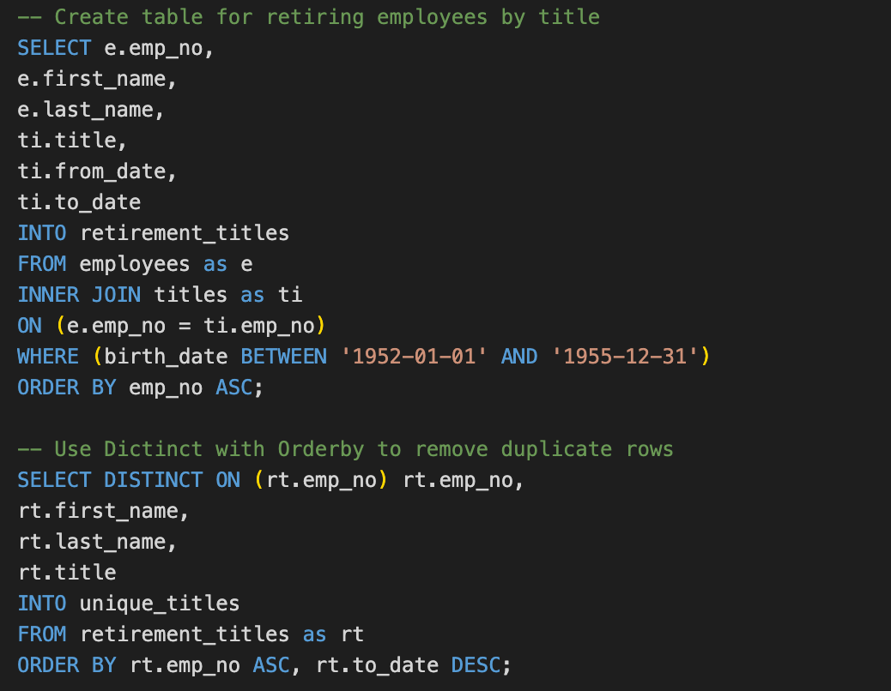
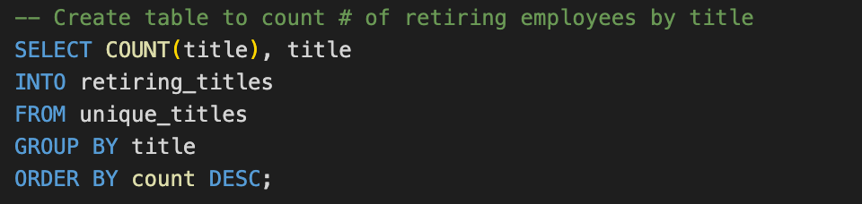
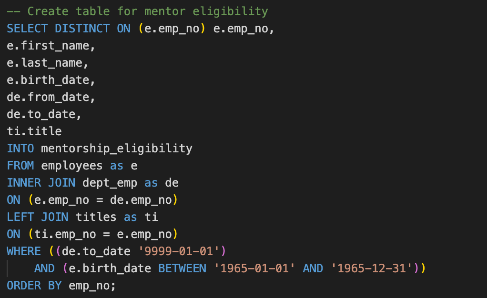
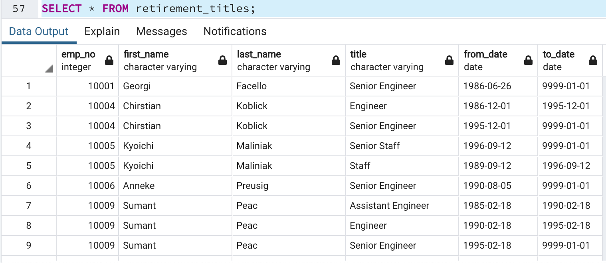
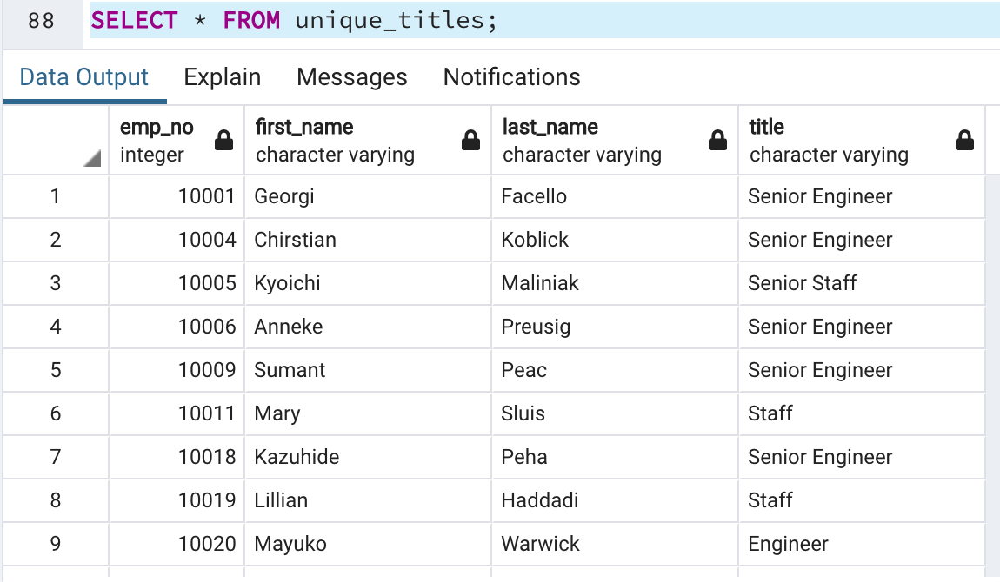

# Pewlett-Hackard-Analysis

### OVERVIEW: 
After a thorough deep-dive in the dataset (exploratory analysis, descriptive analysis, etc.) from Pewitt-Hackard, two additional queries were run on the data to reflect the number of retiring employees per title, so that the company may prepare for the “silver tsunami” of retirees, as well as to establish a mentorship program to help facilitate a smooth transition of titles within the company. These two queries may be found in the Queries folder, titled [Employee_Database_challenge](path/to/Employee_Database_challenge.sql)

.

#### Number of Retirees Per Title
The query for the number of retiring employees per title (D1) yields a table with 133,776 rows, which is located in the Data folder, titled retirement_titles.csv. We noticed that some of the rows in the table had repeating employee numbers due to a change in position or title of some employees (i.e. promotion). We revised this query to reflect the retiring employees current titles in the table title unique_titles, which yields a table with 90,398 rows. We then counted the number of retiring employees by title, to break down how many positions will have upcoming retirees. A preview of this query is displayed below: 

Further, a table was created the reflect the number of retiring titles to give a quick overview of how many people from each title the company will need to transition from having. See query preview below:

#### Potential Mentors Program
The mentorship program intends to initiate transitional employment for upcoming retirees, on a part-time basis, in order to train the next phase of employees in their mentor’s former titles. For example, the retiring Senior Engineers would train the next generation of Senior Engineers to come. The program will allow a smooth transition of responsibility within the company. The criteria for eligibilty includes employees whose birth dates are between January 1, 1965 and December 31, 1965. The mentorship_eligibilty.cvs file is located in the Data folder. The query written is displayed below:

### RESULTS:
#### Results from Two Queries

### SUMMARY:
####
I looked at data sets for a company called Pewitt Hackard and ran queries on the data from various departments and different categories for the team and I created new tables to reflect specific information for queries of the company had and one of the biggest queries of the company had is to find out how many of their employees are set to retire soon and which of those employees will be eligible for a retirement package so there were specific criteria such as how long the employee has worked for the company as well as how old the employee is in order for them to be eligible for retirement package and in addition to finding out how many employees would be retiring the company Pewitt Hackard wanted to know how many of these employees would be willing and able to participate in a mentorship program which means that not only the employees that are set to retire but employees that have already retired if they would consider being mentors to up-and-coming leaders in the company on a part-time basis so if they had the tired they may be rehired or if they were full-time they may go into part-time position and this would help the company not having any gaps in performing higher duties and not leave a big gaping hole in the number of employees they have for the Department's even for employees who weren't necessarily in leadership positions but they work for the company for a long time so it's giving the company the foresight they need to stay afloat and have smooth transition

I don't have the numbers in front of me but I know that the total employees listed in the Raw data for the employees CSV file has over 300,000 employees and when I ran a query to figure out how many employees would be age eligible for retirement that number dropped down to maybe 50000 I'll go look over a significant drop and when I ran another query to see how many people would be mentorship eligible based on the specific criteria with their birthdate and how long they've worked for the company that number dropped to maybe 7000 so if the data reflects that tens of thousands of employees are set to retire I don't think that 7,000 mentors is enough to train the next generation of leaders. Circumstances where that might work if the mentors were given a timeline or different phases of training where they would have a certain amount of mentees for a certain amount of time and then move on and move on and move on. The employees that were trained in that initial phase also helped train the next phase and so on. Could work and that would be more cost-efficient for the company and after that initial phase I think would be less work for the individual employees and I think it also create bonds between the leadership roles that would be important for again smooth transactions and cooperation 

So the question is are is every person who's eligible for retirement set to retire and I don't know the answer to that off the top of my head because I think of that the process I think would either be that an employee submits and writing that there looking to retire but they're retiring or the company presents a retirement package to this employee and says hey you're eligible for this what do you think sit with that Etc I would say that's how the process goes so we would need additional data and queries following that data to have a more accurate representation on who's actually going to retire unless the company requires you to retire at a certain point and even further than that we have a query on how many current employees and former employees are eligible to be mentors how many of them will actually take that position is another. We could run some averages or standard deviations for who is likely to retire, which would give the company a head-start in dropping the outliers.
