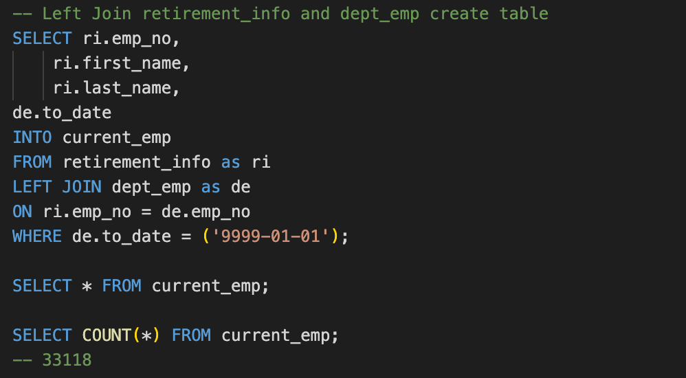

# Pewlett-Hackard-Analysis

### OVERVIEW: 
After a thorough deep-dive in the dataset (exploratory analysis, descriptive analysis, etc.) from Pewitt-Hackard, two additional queries were run on the data to reflect the number of retiring employees per title, so that the company may prepare for the “silver tsunami” of retirees, as well as to establish a mentorship program to help facilitate a smooth transition of titles within the company. These two queries may be found in the Queries folder of this analysis: 
.

To elaborate more on the connections made within the dataset, an ERD is displayed below: 

#### Number of Retirees Per Title
The query for the number of retiring employees per title (D1) yields a table with 133,776 rows, which is located in the Data folder titled 
. Some of the rows in the table had repeating employee numbers due to a change in position or title of some employees (i.e. a promotion). A revised query to reflect the retiring employees current title is in the Data folder, titled , which yields a table with 90,398 rows. 

Next, the number of retiring employees by title was counted to break down how many positions will have upcoming retirees. A preview of this query is displayed below: 

Further, a table was created the reflect the number of 
 titles to give a quick overview of how many people from each title the company will need to transition from having. See a preview of the query below:

#### Potential Mentors Program
The mentorship program is designed to initiate transitional employment for upcoming retirees, on a part-time basis, in order to train the next phase of employees in their mentor’s former titles. For example, the retiring Senior Engineers would train the next generation of Senior Engineers to come. The program will allow a smooth transition of responsibility within the company. The criteria for eligibilty includes employees whose birth dates are between January 1, 1965 and December 31, 1965. The  file is located in the Data folder. The query written is displayed below:

### RESULTS:
#### Retiring Titles
Retirement Titles table: 

Unique Titles table: 

Retiring Titles table:

#### Eligible Mentors
Mentorship Eligiblity table:

#### Major Takeaways
* Pewlett Hackard must prepare for a major departure of employees from the company, spanning 7 different departments (retiring_titles)
* There are 90,398 employees from these 7 departments who are approaching retirement (unique_titles)
* Of those 90,398 employees who are approaching retirement, 1,549, or 1.7% of them fit the criteria for the mentorship program (mentorship_eligibility)
* The company should think about how they can expand their criteria for mentors to fit the demand for transition of titles

### SUMMARY:
#### Summary of Analysis
Data from Pewitt Hackard was analyzed by running queries and creating tables to reflect specific information. In the end, the company wanted to find out how many of their employees are set to retire soon (or have already retired) and which of these employees will be eligible for a retirement package as well as a mentorship program. There was specific criteria, such as how long an employee has worked for the company, or how old the employee is, to determine who is eligible for these benefits or programs. 

The mentorship would be a hired, part-time position to train up-and-coming leaders for the company. If the eligible employees already retired then they may be re-hired or if they were full-time they may go into a part-time position. This would help the company fill-in gaps and transition to new titles smoothly.

[The summary addresses the two questions and contains two additional queries or tables that may provide more insight.]

#### Further Analysis
Another table to consider in order to expand the mentorship program may be to look at the company's current employees (see  table in Additional_Tables subfolder, within Data folder) and select passionate individuals who are willing to volunteer their time in assisting the mentors in training future employees. This would be a total of 33,118 employees who may want to volunteer. A preview of this query may be found here: 

One more table to consider would be the  table (same folder as current_emp). This table gives insight on which department(s) have the highest demand or need for transitionary titles. See image below: 
